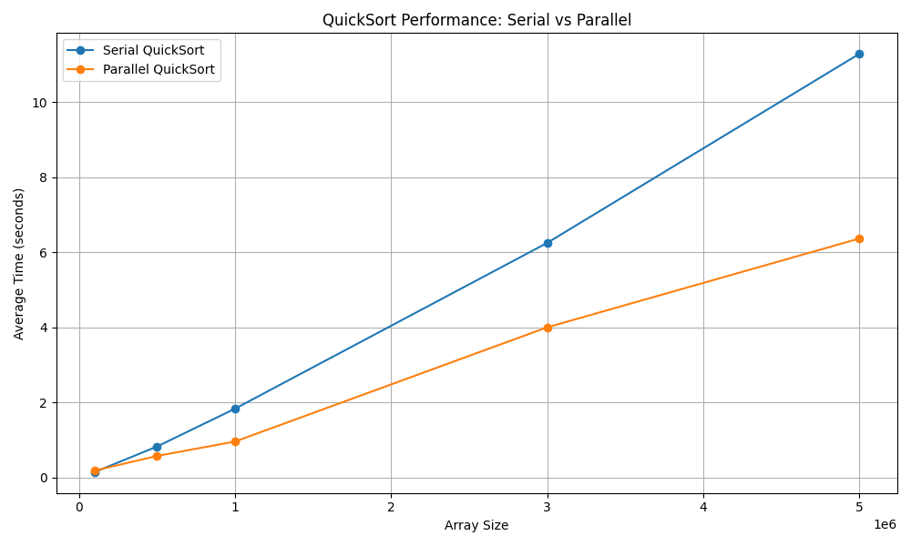

# MiniHPC QuickSort Benchmark

[](https://www.python.org/)

---

## Overview

This project demonstrates efficient implementation and benchmarking of **Parallel** and **Serial QuickSort algorithms** in Python. It showcases practical HPC techniques such as process-level parallelism, memory profiling, performance optimization for sorting large datasets, and benchmarking.

- **Serial QuickSort:** A clean recursive implementation of QuickSort.
- **Parallel QuickSort:** Uses Python's `concurrent.futures.ProcessPoolExecutor` to speed up sorting by parallelizing top-level partitions.
- **Benchmarking:** Compares runtime and memory consumption of serial and parallel implementations on large arrays.
- **Memory Profiling:** Integrates `memory_profiler` to measure peak memory usage during sorting.

---

## Features

- Parallelizes QuickSort at the top partition level with minimal overhead.
- Uses adaptive thresholds to decide when to parallelize based on input size.
- Efficient merging of sorted chunks when applicable.
- Detailed benchmarking with time and memory usage metrics.
- Modular design for easy extension or integration.

---

## Benchmark Suite

The benchmark suite tests **Serial** and **Parallel QuickSort** implementations over multiple array sizes and runs, providing comprehensive performance analysis.

- Runs multiple trials per array size to ensure stable results.
- Records elapsed time for each run.
- Saves results in `benchmark_results.csv` for further analysis.
- Generates a performance plot (`benchmark_plot.png`) visualizing average runtime across input sizes.
- Uses `matplotlib` for plotting.



### Running the Benchmark Suite

```bash
python benchmark_suite.py
```
---

## Website

A website displaying the results can be found at: https://minihpc-quicksort-benchmark.onrender.com

---


## Tech Stack

 
